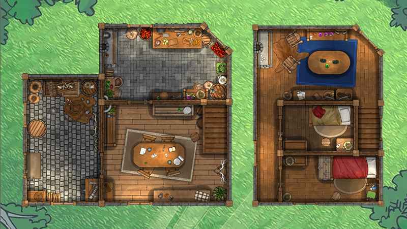

<!-- stylesheet -->
<link rel='stylesheet' href='./style.css'>

<!--
 █████  ████   ████
   █   █    █ █
   █   █    █ █
   █   █    █ █
   █    ████   ████
 SECTION: toc / table of contents
-->
<div id='toc-wrapper'>
<a id='sf-link' href='https://sleepyfool-gh.github.io/Sleepy_macros/'>
    <h1>Sleepy Macros</h1>
</a>
<aside id='toc' markdown='1'>
<h2>Table of Contents</h2>

- **[Intro](#intro)**
- **[Macros](#macros)**
    - *Initialization*
        - [`<<new_areamap>>`](#macro-new_areamap)
    - *Interface Items*
        - [`<<place_arearose>>`](#macro-place_arearose)
        - [`<<update_arearose>>`](#macro-update_arearose)
        - [`<<place_areamapview>>`](#macro-place_areamapview)
        - [`<<update_areamapview>>`](#macro-update_areamapview)
    - *Scripts*
        - [`<<set_areascripts>>`](#macro-set_areascripts)
    - *Movement*
        - [`<<areamapmove>>`](#macro-areamapmove)
- **[JavaScript Methods](#javascript)**
    - *Initialization*
        - [`new_areamap`](#javascript-new_areamap)
    - *Interface Items*
        - [`create_rose`](#javascript-create_rose)
        - [`update_rose`](#javascript-update_rose)
        - [`create_mapview`](#javascript-create_mapview)
        - [`update_mapview`](#javascript-update_mapview)
    - *Scripts*
        - [`set_areascripts`](#javascript-set_areascripts)
    - *Movement*
        - [`begin_mapmove`](#javascript-begin_mapmove)
    - *Utilities*
        - [`get_map`](#javascript-get_map)
        - [`edit_map`](#javascript-edit_map)
- **[Events](#events)**
    - [`areamap:mapmove_began`](#events-mapmove_began)
    - [`areamap:mapmove_resolved`](#events-mapmove_resolved)
    - [`areamap:map_edited`](#events-map_edited)
- **[Options](#options)**
- **[Usage Tips & Styling](#tips)**
</aside>
</div>


<section id='main' markdown='1'>
<!--
 ███ █    █ █████ ████   ████
  █  ██   █   █   █   █ █    █
  █  █ █  █   █   ████  █    █
  █  █  █ █   █   █   █ █    █
 ███ █   ██   █   █   █  ████
 SECTION: intro
-->

<h1 id='intro'><code>Sleepymap</code> Library</h1>

`Sleepymap` is a map library for SugarCube which takes a space-separated 2D text grid (`maparray`) and converts it into a functional map for player movement (`mapmove`). It has two modes:
    1. **`node travel`:** Node-to-node movement like **Faster Than Light** or room-to-room movement like **Darkest Dungeon**. All grid spaces with the same id will be treated as one big room (`mapnode`) — regardless of how many grid spaces it occupies or whether it is continuous or not. Adjacent `mapnode` will be connected by `exits` that allow navigation between them. Because `mapnode` size is irrelevant, multiple links to different rooms may appear in the same direction on the `rose` (default / set by `grid_travel = false`)
    2. **`grid travel`:** Grid movement like **Zelda** or **Final Fantasy Tactics**. Adjacent grid spaces with the same id will inherit the same properties, but will need to be traversed through one grid space at a time. Each grid space is connected by `exits` to adjacent grid spaces it can reach. (set by `grid_travel = true`)
**Note:** `mapmove` *DOES NOT* trigger passage navigation. Authors **must** navigate to save map changes to `State`.

[Get the map library here](https://github.com/SleepyFool-gh/areamap)

<video width="635" height="558" controls>
  <source src="./demo/small_house.mp4" type="video/mp4">
  Your browser does not support the video tag.
</video>

#### Features:

- **Built-in navigation `interfaces`:**
    - compass rose with directional buttons (`rose`)
    - visual map, optionally clickable `mapnodes`, optional pathing (`mapview`)
    - both `interface` items also accept keydown inputs for triggering `mapmove` with the keyboard
- **TwineScripts payloads:** Scripts can be assigned to run at various stages of the `mapmove` process and conditionally on nodes or grid spaces.
- **Linked `story variables`:** Map states are saved in `State` and survive passage navigations and saves / loads.
- **Manually adjust exits:** While exits are automatically generated from the provided `maparray`, it can be manually tweaked to create more complex navigation patterns.
- **`mapnode` behavior manipulation:** 
    - `hidden` — links & maptiles hidden, but navigation still works
    - `disabled` — links & maptiles disabled, but navigation still works if triggered manually
    - `blocked` — links & maptiles still available, but movement through it is blocked
    - `walled` — changes the `mapnode` into a wall that blocks movement
- **Entity placement:** Entities can be set and moved around the `map` — though interactions must be handled by the author
- **JavaScript methods:** for manipulating maps, `mapnodes`, `mapstates`, `exits`,`roses`, `mapviews`,  and `entities`. 
- **Configurable defaults:** for various settings

<p align="center">
    &bull; &bull; &bull;
</p>


<!--
 █    █  ███   ████ ████   ████   ████
 ██  ██ █   █ █     █   █ █    █ █
 █ ██ █ █████ █     ████  █    █  ███
 █    █ █   █ █     █   █ █    █     █
 █    █ █   █  ████ █   █  ████  ████
 SECTION: macros
-->

<h2 id="macros">Macros</h2>

<h3 id="macro-new_map"><code>&lt;&lt;new_map&gt;&gt;</code></h3>

Defines a new `Sleepymap`. This macro **must** be called in `StoryInit`. It accepts a 2D grid layout via its contents and supports optional child tags for advanced configuration.

- **Arguments:** 
    - `mapname`: (string) name of `map`
    - `grid_travel`: (boolean) *(optional)* whether to use grid-based movement (default: `false`, node-to-node movement)
    - `start`: (string) *(`node travel`)* starting position in map, must be a valid `mapnode` id
    - `start_x`: (number) *(`grid travel`)* starting x coordinate
    - `start_y`: (number) *(`grid travel`)* starting y coordinate
    - `columns`: (number) # of columns in the logic representation grid
    - `diagonals`: (boolean) *(optional)* whether diagonal movement is allowed
- **Contents:** 
    - 2D space-separated text grid representing map logic, must be rectangular. By default, several wall and border options are available. These can be changed via `options`, but thin borders requires Regex. For a mapnode with id `id`, the defaults are:
        - thick wall which occupies its own grid cell: `.`
        - thin border to N of grid cell: `"id` or `id"`
        - thin border to E of grid cell: `id|`
        - thin border to S of grid cell: `_id` or `id_`
        - thin border to W of grid cell: `id\`
        - thin border to NE of grid cell: `id\`
        - thin border to SE of grid cell: `id/`
        - thin broder to SW of grid cell: `\id`
        - thin border to NW of grid cell: `/id`
- **Child Tags:**
    - `<<mapnodes>>`: (object) *(optional)* Defines additional metadata for each `mapnode`. Partial objects will be filled with default values.
        - `[mapnode id]`: (object) `mapnode` data object
            - `name`: (string) *(optional)* used for links in `roses` & for the `show_labels` option in `mapviews`, default is the `mapnode` id
            - `tile`: (HTML string) *(optional)* inserted into each space in the `mapview`, default none
            - `disabled`: (boolean) *(optional)* disables `interface` links for this node, default `false`
            - `hidden`: (boolean) *(optional)* hides the node and links by setting opacity to zero, default `false`
            - `blocked`: (boolean) *(optional)* stops movement through this node but will not stop the player from *trying* to move through it, default `false`
            - `walled`: (boolean) *(optional)* turns the node into a wall, default `false`
- **Examples:**
    ```js
    /* define mapnodes */
    <<set _mapnodes = {
        M: {name: 'Master Bedroom'},
        G: {name: 'Guest Bedroom'},
        H: {name: 'Hallway'},
        L: {name: 'Living Room'},
        S: {name: 'Stairs'},
        D: {name: 'Dining Room'},
        K: {name: 'Kitchen'},
        P: {name: 'Pantry'},
    }>>

    /* new node travel map */
    <<new_map 
        mapname     'node_house'
        columns     16
        start       'D'
    >>
        .   .   .   .   .   .   .   .    .   .   .   .   .   .    .   .
        .   .   .   .   K   K   K   K    K   .   L   L   L   L    L   .
        .   .   .   .   K   K   K   K    K   .   L   L   L   L    L   .
        .   P   P   P|  K_  K   K_  K_  _K   .   L   L_  L_  L_   L   .
        .   P   P   P|  D   D   D   D   |S   .   H  |G   G   G   |S   .
        .   P   P   P|  D   D   D   D   |S   .   H   G_  G_  G_ _|S   .
        .   P   P   P   D   D   D   D    D   .   H  |M   M   M    M   .
        .   P   P   P|  D   D   D   D    D   .   H   M   M   M    M   .
        .   .   .   .   .   .   .   .    .   .   .   .   .   .    .   .
    <<mapnodes _mapnodes>>
    <</new_map>>

    /* new grid travel map */
    <<new_map 
        mapname     'grid_house'
        columns     16
        grid_mode   true
        start_x     4
        start_y     5
    >>
        .   .   .   .   .   .   .   .    .   .   .   .   .   .    .   .
        .   .   .   .   K   K   K   K    K   .   L   L   L   L    L   .
        .   .   .   .   K   K   K   K    K   .   L   L   L   L    L   .
        .   P   P   P|  K_  K   K_  K_  _K   .   L   L_  L_  L_   L   .
        .   P   P   P|  D   D   D   D   |S   .   H  |G   G   G   |S   .
        .   P   P   P|  D   D   D   D   |S   .   H   G_  G_  G_ _|S   .
        .   P   P   P   D   D   D   D    D   .   H  |M   M   M    M   .
        .   P   P   P|  D   D   D   D    D   .   H   M   M   M    M   .
        .   .   .   .   .   .   .   .    .   .   .   .   .   .    .   .
    <<mapnodes _mapnodes>>
    <</new_map>>
    ```


<h3 id="macro-set_mapnode"><code>&lt;&lt;set_mapnode&gt;&gt;</code></h3>

Updates the metadata for a specific `mapnode` in an existing `map`. Incomplete objects are accepted, only the specified properties will be updated. `mapnode` ids *cannot* be changed. `node travel` and `grid travel` maps use the same syntax.

- **Arguments:** 
    - `mapname`: (string) name of `map`
    - `mapnode`: (string) id of the `mapnode` to modify
    - `data`: (object) object containing properties to update
        - `name`: (string) *(optional)* display name
        - `tile`: (HTML string) *(optional)* display tile to be printed in `mapview`
        - `disabled`: (boolean) *(optional)* stops `interface` interactions
        - `hidden`: (boolean) *(optional)* hides links on `roses` and tiles on `mapviews` by setting opacity to zero
        - `blocked`: (boolean) *(optional)* stops `mapmove` through it, but doesn't prevent attempts
        - `walled`: (boolean) *(optional)* turns the `mapnode` into a wall, stopping `mapmove` and attempts
- **Examples:**
    ```js
    /* lock the pantry */
    <<set _P = { name: 'Locked Pantry', blocked: true }>>
    <<set_mapnode
        mapname     'node_house'
        mapnode     'P'
        data        _P
    >>
    ```


<h3 id="macro-set_mapstate"><code>&lt;&lt;set_mapstate&gt;&gt;</code></h3>

Updates the operational state (`mapstate`) of a map, such as the current position, or toggles states like `blocked` or `hidden` for multiple mapnodes at once. `node travel` and `grid travel` maps use the same syntax. This macro will update `interface` items set to autoupdate.

- **Arguments:** 
    - `mapname`: (string) name of `map`
    - `position`: (object) *(optional)* 
        - For `node travel`: 
            - `mapnode`: id of new `mapnode` position
        - For `grid travel`: 
            - `x`: (number) new x position
            - `y`: (number) new y position
    - `frozen`: (boolean) *(optional)* disables *all* `interface` interactions if true
    - `disabled`: (object) *(optional)*
        - `[mapnode id]`: (boolean) whether the `mapnode` is disabled
    - `hidden`: (object) *(optional)*
        - `[mapnode id]`: (boolean) whether the `mapnode` is hidden
    - `blocked`: (object) *(optional)*
        - `[mapnode id]`: (boolean) whether the `mapnode` is blocked
    - `walled`: (object) *(optional)*
        - `[mapnode id]`: (boolean) whether the `mapnode` is walled
- **Examples:**
    ```js
    /* move player in grid mode */
    <<set _position = { x: 10, y: 5 }>>
    <<set_mapstate
        mapname     'grid_house'
        position    _position
    >>

    /* unlock pantry and hide both bedrooms */
    <<set _blocked = { 'P': false }>>
    <<set _hidden = { 'M': true, 'G': true }>>
    <<set_mapstate
        mapname     'node_house'
        blocked     _blocked
        hidden      _hidden
    >>
    ```


<h3 id="macro-connect_map"><code>&lt;&lt;connect_map&gt;&gt;</code></h3>

Manually creates a new exit between two `mapnodes` or two grid coordinates. If this is a `node travel` map, specify `from` and `to`. If this is a `grid travel` map, specify `from_x`, `from_y`, `to_x`, and `to_y`.

- **Arguments:** 
    - `mapname`: (string) name of `map`
    - `direction`: (string) the direction of the connection ("N", "E", "S", "W", "NE", "SE", "SW", "NW")
    - `from` / `to`: (string) *(`node travel`)* ids of the nodes to connect
    - `from_x`/`from_y` / `to_x`/`to_y`: (number) *(`grid travel`)* coordinates to connect
- **Examples:**
    ```js
    /* node travel, create secret passage from master bedroom to pantry */
    <<connect_map 
        mapname     'node_house' 
        from        'M' 
        to          'P' 
        direction   'S' 
    >>

    /* grid travel, connect the bottom floor stairs to the top floor stairs */
    <<connect_map
        mapname     "grid_house"
        from_x      8
        from_y      4
        to_x        14
        to_y        5
        direction   "N"
    >>
    ```

<h3 id="macro-disconnect_map"><code>&lt;&lt;disconnect_map&gt;&gt;</code></h3>

Removes an exit that was automatically created between two `mapnodes` or grid coordinates from the `maparray`. If this is a `node travel` map, specify `from` and `to`. If this is a `grid travel` map, specify `from_x`, `from_y`, `to_x`, and `to_y`.

- **Arguments:** 
    - `mapname`: (string) name of `map`
    - `direction`: (string) the direction of the connection to remove
    - `from` / `to`: (string) *(`node travel`)* IDs of the nodes to disconnect
    - `from_x`/`from_y` / `to_x`/`to_y`: (number) *(`grid travel`)* coordinates to disconnect
- **Examples:**
    ```js
    /* make leaving the kitchen impossible by removing the exit back to dining room */
    <<disconnect_map 
        mapname   'node_house' 
        direction 'S' 
        from      'K' 
        to        'D' 
    >>
    ```


<h3 id="macro-place_rose"><code>&lt;&lt;place_rose&gt;&gt;</code></h3>

Generates a 3x3 grid of directional links for navigation.

- **Arguments:** 
    - `mapname`: (string) name of `map`
    - `background`: (HTML string) *(optional)* inserted as a background element for the `rose`
    - `autoupdate`: (boolean) *(optional)* whether the `rose` automatically updates after each `mapmove` or when the `map` changes, default set in `options`
    - `keydown`: (object) *(optional)* enables keyboard control, if multiple links are present in a given direction, the first one will be triggered
        - `[direction]`: (string\|array\<string\>) keydown identifiers to assign to each direction
- **Examples:**
    ```js
    /* places a rose with keybinds attached */
    <<set _keys = {
        N: ["w", "ArrowUp"],
        S: ["s", "ArrowDown"],
        E: ["d", "ArrowRight"],
        W: ["a", "ArrowLeft"]
    }>>
    <<place_rose
        mapname     'grid_house'
        background  ''
        keydown     _keys
    >>
    ```


<h3 id="macro-place_mapview"><code>&lt;&lt;place_mapview&gt;&gt;</code></h3>

Renders a visual representation of the `map` with the tiles using the `maparray`. Options include clickable tiles,`mapnode` labels, path highlighting (`grid travel`), and quick moving to distant tiles (`grid travel`).

- **Arguments:** 
    - `mapname`: (string) name of `map`
    - `background`: (HTML string) *(optional)* inserted as a background element for the `mapview`
    - `autoupdate`: (boolean) *(optional)* whether the `mapview` automatically updates after each `mapmove` or when the `map` changes, default set in `options`
    - `clickable`: (boolean) *(optional)* whether nodes can be clicked to navigate, default set in `options`
    - `show_labels`: (boolean) *(optional)* whether to display labels (names or directional icons) for each node, default set in `options`
    - `pathing`: (boolean) *(optional)* whether to highlight the path to the hovered tile, default set in `options`
    - `quickmove`: (boolean) *(optional)* whether clicking a distant traversable tile initiates multiple sequential `mapmoves`, default set in `options`, quickmove forces the `mapview` to be clickable
    - `keydown`: (object) *(optional)* enables keyboard control
        - `[direction]`: (string\|array&lt;string&gt;) keydown identifiers to assign to each direction
- **Examples:**
    ```js
    /* places a mapview that has pathing enabled */
    <<place_mapview
        mapname     'small_house'
        background  ''
        clickable   true
        pathing     true
        quickmove   true
    >>
    ```

<h3 id="macro-update_interface"><code>&lt;&lt;update_interface&gt;&gt;</code></h3>

Manually triggers an update for a `rose` or `mapview` element. This is useful if the author has manually modified `interface` items or turned off autoupdate.

- **Arguments:** 
    - `selector`: (selector string) jQuery selector for the interface element(s) to update
- **Examples:**
    ```js
    /* updates all mapviews on the page */
    <<update_interface selector '.macro-Sleepymap-mapview'>>
    ```


<h3 id="macro-new_entity"><code>&lt;&lt;new_entity&gt;&gt;</code></h3>

Creates a new entity on the map at the specified coordinates. This macro takes `x` and `y` inputs in both `node travel` and `grid travel`.

- **Arguments:** 
    - `mapname`: (string) name of `map`
    - `entityname`: (string) unique identifier for the entity
    - `x`: (number) x coordinate
    - `y`: (number) y coordinate
    - `tile`: (HTML string) *(optional)* display tile for the entity
- **Examples:**
    ```js
    /* places a kitty in the dining room */
    <<new_entity 
        mapname     'node_house' 
        entityname  'kitty' 
        x           7
        y           5
        tile        '🐱'
    >>
    ```


<h3 id="macro-set_entity"><code>&lt;&lt;set_entity&gt;&gt;</code></h3>

Updates the position or display tile of an existing entity. This macro takes `x` and `y` inputs in both `node travel` and `grid travel`.

- **Arguments:** 
    - `mapname`: (string) name of `map`
    - `entityname`: (string) identifier of the entity to modify
    - `x`: (number) new x coordinate
    - `y`: (number) new y coordinate
    - `tile`: (HTML string) *(optional)* new display tile
- **Examples:**
    ```js
    /* move the kitty to the pantry */
    <<set_entity 
        mapname    'node_house' 
        entityname 'kitty' 
        x          2
        y          6
    >>
    ```

<h3 id="macro-delete_entity"><code>&lt;&lt;delete_entity&gt;&gt;</code></h3>

Removes an entity from the map.

- **Arguments:** 
    - `mapname`: (string) name of `map`
    - `entityname`: (string) identifier of the entity to remove
- **Examples:**
    ```js
    /* remove the kitty from the map */
    <<delete_entity 
        mapname    'node_house' 
        entityname 'kitty' 
    >>
    ```

<h3 id="macro-set_mapscripts"><code>&lt;&lt;set_mapscripts&gt;&gt;</code></h3>

Assigns TwineScript logic to run during the `mapmove` process (`mapscript`). This macro **must** be called in `StoryInit`. Both `node travel` and `grid travel` can use any combination of `from`/`to`/`from_x`/`from_y`/`to_x`/`to_y`.  If multiple arguments are set, *all* must be true for the `mapscript` to fire. The `any` keyword can be used to signal that any value will trigger the `mapscript` (which does the same thing as not setting the argument at all).

 Child tag order is preserved: `<<onmapattempt>>` tags always run first, followed by:
    - when `mapmove` succeeds: `<<onmapstart>>` then `<<onmapend>>`
    - when `mapmove` fails: `<<onmapabort>>`

- **Arguments:**
    - `mapname`: (string) name of `map`
- **Child Tags:**
    - `<<onmapattempt>>`: *(optional)* Always runs immediately when a `mapmove` is attempted.
    - `<<onmapstart>>`: *(optional)* Only runs when `mapmove` succeeds, before the position is updated.
    - `<<onmapend>>`: *(optional)* Only runs when `mapmove` succeeds, after the position is updated.
    - `<<onmapabort>>`: *(optional)* Only runs when `mapmove` fails.
    - **Arguments for all Child Tags:**
        - `from`: (string\|array&lt;string&gt;\|"any") *(optional)* ID(s) of the node the player is moving from.
        - `to`: (string\|array&lt;string&gt;\|"any") *(optional)* ID(s) of the node the player is moving to.
        - `from_x`, `from_y`: (number\|array&lt;number&gt;\|"any") *(optional)* Grid coordinates player is moving from.
        - `to_x`, `to_y`: (number\|array&lt;number&gt;\|"any") *(optional)* Grid coordinates player is moving to.
- **Contents:**
    - TwineScript code to execute when the conditions set in the arguments are met.
- **Examples:**
    ```js
    <<set_mapscripts mapname 'node_house'>>
        /* decrement energy whenever a mapmove is attempted */
        <<onmapattempt>>
            <<set $energy-->>
        /* increase heat when moving around upstairs */
        <<onmapattempt to `['L', 'H', 'G', 'M']`>>
            <<set $heat++>>
        /* ring a bell when coming down the stairs */
        <<onmapstart from 'S' to 'D'>>
            <<run console.log('Ding!')>>
        /* increase hunger when entering the kitchen or pantry */
        <<onmapend from 'D' to `['K', 'P']`>>
            <<set $hunger++>>   
    <</set_mapscripts>>
    ```


<h3 id="macro-mapmove"><code>&lt;&lt;mapmove&gt;&gt;</code></h3>

Manually triggers a `mapmove` attempt. This macro *does not* check against exits, allowing for more complex movement control — it *will* however fail if the destination is `blocked` or `walled`. `mapscripts` will be triggered as normal.

- **Arguments:** 
    - `mapname`: (string) name of `map`
    - `target_mapnode`: (string) *(`node travel`)* id of the node to move to (node mode)
    - `target_x`: (number) *(`grid travel`)* target x coordinate (grid mode)
    - `target_y`: (number) *(`grid travel`)* target y coordinate (grid mode)
    - `force_abort`: (boolean) *(optional)* `true` forces the `mapmove` to fail, default `false`
    - `skip_scripts`: (boolean) *(optional)* `true` to bypass all `onmap` scripts for this `mapmove`, default `false`
- **Examples:**
    ```js
    /* teleport to master bedroom */
    <<mapmove mapname 'node_house' target_mapnode 'M'>>

    /* teleport to grid position (5, 2) */
    <<mapmove mapname 'small_house' target_x 5 target_y 2>>
    ```

<p align="center">
    &bull; &bull; &bull;
</p>


<!--
 █    █ █████ █████ █   █  ████  ████   ████
 ██  ██ █       █   █   █ █    █ █   █ █
 █ ██ █ ███     █   █████ █    █ █   █  ███
 █    █ █       █   █   █ █    █ █   █     █
 █    █ █████   █   █   █  ████  ████  ████
 SECTION: methods
-->

<h2 id='javascript'>JavaScript Methods</h2>

Javascript methods are stored on the `Sleepymap` window object. All methods take an `argObj` argument object.

<h3 id='javascript-new_map'><code>new_map</code></h3>

Creates a new `Sleepymap`. The `<<new_map>>` macro is a wrapper for this method.

- **argObj Properties:**
    - `mapname`: (string) name of `map`
    - `columns`: (number) number of columns in the logic representation grid
    - `maparray`: (array&lt;string&gt;) 1D array of `mapnode` ids representing the map navigation logic, length must be divisible by `columns`
    - `grid_travel`: (boolean) *(optional)* whether to use grid-based movement (default: `false`, node-to-node movement)
    - `start`: (string) *(`node travel`)* starting position on map, must be a valid `mapnode` id
    - `start_x`: (number) *(`grid travel`)* starting x coordinate
    - `start_y`: (number) *(`grid travel`)* starting y coordinate
    - `diagonals`: (boolean) *(optional)* whether diagonal movement is allowed, default set in `options`
    - `mapnodes`: (object) *(optional)* additional metadata for `mapnodes`, partial objects will be filled with default values
        - `[mapnode id]`: (object)
            - `name`: (string) *(optional)* used for links in `roses` & for the `show_labels` option in `mapviews`, default is the `mapnode` id
            - `tile`: (HTML string) *(optional)* inserted into each space in the `mapview`, default `undefined`
            - `disabled`: (boolean) *(optional)* disables `interface` links for this node, default `false`
            - `hidden`: (boolean) *(optional)* hides the node and links by setting opacity to zero, default `false`
            - `blocked`: (boolean) *(optional)* stops `mapmove` through it, but doesn't prevent attempts, default `false`
            - `walled`: (boolean) *(optional)* turns the node into a wall, stopping `mapmove` and attempts, default `false`
- **Examples:**
    ```js
    /* create a new node travel map */
    Sleepymap.new_map({
        mapname  : 'node_house',
        columns  : 16,
        start    : 'D',
        maparray : ['.', '.', '.', ...], // etc, rest of maparray
        mapnodes : {
            D : { name: 'Dining Room' },
            K : { name: 'Kitchen' },
            // etc, other mapnodes
        },
    });

    /* create a new grid travel map */
    Sleepymap.new_map({
        mapname     : 'grid_house',
        columns     : 16,
        grid_travel : true,
        start_x     : 4,
        start_y     : 5,
        maparray    : ['.', '.', '.', ...], // etc, rest of maparray
        mapnodes    : {
            D : { name: 'Dining Room' },
            K : { name: 'Kitchen' },
            // etc, other mapnodes
        },
    });
    ```


<h3 id='javascript-get_map'><code>get_map</code></h3>

Retrieves a copy of a map object. Manipulating the returned object *will not* affect or update the original map. Use `Sleepymap.set_map` to edit `maps`.

- **argObj Properties:**
    - `mapname`: (string) name of the `map` to retrieve
- **Returns:** An object containing the map's structure:
- **Examples:**
    ```js
    // get node_house object
    const node_house = Sleepymap.get_map({
        mapname: 'node_house',
    });
    // returns
    {
        mapname     : 'node_house',
        columns     : 16,
        diagonals   : false,
        grid_travel : false,
        frozen      : false,
        maparray    : ['.', '.', '.', ...], // etc, rest of maparray
        barriers    : [
            {N: false, E: false, W: false, S: false, NE: false, NW: false, SE: false, SW: false},
            // etc, maps 1:1 to maparray
        ],
        mapnodes: {
            D: { 
                id          : 'D',
                name        : 'Dining Room',
                disabled    : false,
                hidden      : false,
                blocked     : false,
                walled      : false,
            },
            // etc, other mapnodes
        },
        position: {
            mapnode : 'D',
            x       : 4,    // non-extant on node travel maps
            y       : 5,    // non-extant on node travel maps
        },
        exits: { // both node & grid exits always get generated regardless of travel mode
            node: {
                '.' : {},   // walls have no exits
                D: {
                    N: Set{'K', 'S'},   // exits point to other mapnode ids
                    W: Set{'P'},
                },
                // etc, other nodes
            },
            grid: [
                {
                    E: Set{20},     // exits point to other maparray indices
                    S: Set{36},
                },
                // etc, maps 1:1 to maparray
            ],
            manaul: [
                {
                    removing: false,    // manual connection, (true) for disconnections 
                    dir: 'N',
                    ​from_x: 8,
                    from_y: 4,
                    to_x: 14,
                    to_y: 5
                },
                // etc, both node & grid manual edits are stored here
            ],
        },
        scripts: [
            {
                type: 'onmapattempt',
                triggers: {
                    to: ['L', 'H', 'G', 'M'],
                },

        <<onmapattempt to `['L', 'H', 'G', 'M']`>>
            <<set $heat++>>
                    
            },
            // etc, other mapscripts
        ],
        entities: {},
    }
    ```

<h3 id='javascript-set_map'><code>set_map</code></h3>

Allows for dynamic modification of an existing `map`. This method will automatically update the `map`'s `exits` and trigger an update for any `roses` or `mapviews` set to autoupdate.

- **argObj Properties:**
    - `mapname`: (string) name of the `map` to modify
    - `diagonals`: (boolean) *(optional)* new diagonal movement state
    - `columns`: (number) *(optional)* new column count, must form a rectangular grid with `maparray`
    - `maparray`: (array&lt;string&gt;) *(optional)* new logic grid array, must form a rectangular grid with `columns`
    - `mapview`: (object) *(optional)* new `mapview` configuration
        - `mapview.columns`: (number) *(optional)* new column count, must form a rectangular grid with `mapview.array`
        - `mapview.array`: (array&lt;string&gt;) *(optional)* new `mapview` array, must form a rectangular grid with `mapview.columns`
- **Examples:**
    ```js
    Sleepymap.set_map({
        mapname   : 'node_house',
        diagonals : true,
    });
    ```


<h3 id='javascript-create_rose'><code>create_rose</code></h3>

Creates a jQuery `rose` element. The `<<place_arearose>>` macro calls this method and appends the result to the macro output.

- **argObj Properties:**
    - `mapname`: (string) name of the `areamap`
    - `autoupdate`: (boolean) *(optional)* whether the `rose` automatically updates, default set in `options`
    - `background`: (HTML string) *(optional)* inserted as a background element
- **Returns:** (jQuery object) the created `$rose` element
- **Examples:**
    ```js
    Areamap.create_rose({
        mapname    : 'small_house',
        autoupdate : true,
        background : '<div>Background</div>',
    });
    ```


<h3 id='javascript-update_rose'><code>update_rose</code></h3>

Manually updates `rose` elements in the DOM. If the jQuery object passed to this method references multiple `roses`, all of them will update. Non-`rose` elements will be ignored. The `<<update_arearose>>` macro is a wrapper for this method. 

- **argObj Properties:**
    - `rose`: (jQuery object) the specific `$rose` element to refresh
- **Examples:**
    ```js
    Areamap.update_rose({
        rose: $('#rose-element'),
    });
    ```


<h3 id='javascript-create_mapview'><code>create_mapview</code></h3>

Creates a jQuery `mapview` element. The `<<place_areamapview>>` macro calls this method and appends the result to the macro output.

- **argObj Properties:**
    - `mapname`: (string) name of the `areamap`
    - `autoupdate`: (boolean) *(optional)* whether the `mapview` automatically updates, default set in `options`
    - `clickable`: (boolean) *(optional)* whether `mapareas` can be clicked to navigate, default set in `options`
    - `show_names`: (boolean) *(optional)* whether to display names for each `maparea`, default set in `options`
    - `background`: (HTML string) *(optional)* inserted as a background element
- **Returns:** (jQuery object) the created `$mapview` element
- **Examples:**
    ```js
    Areamap.create_mapview({
        mapname    : 'small_house',
        clickable  : true,
        background : '<div>Background</div>',
    });
    ```


<h3 id='javascript-update_mapview'><code>update_mapview</code></h3>

Manually updates `mapview` elements in the DOM. If the jQuery object passed to this method references multiple `mapviews`, all of them will update. Non-`mapview` elements will be ignored. The `<<update_areamapview>>` macro is a wrapper for this method.

- **argObj Properties:**
    - `mapview`: (jQuery object) the specific `$mapview` element to refresh
- **Examples:**
    ```js
    Areamap.update_mapview({
        mapview: $('#mapview-element'),
    });
    ```


<h3 id='javascript-set_areascripts'><code>set_areascripts</code></h3>

Assigns `TwineScript` logic to run during the `mapmove` process. The `<<set_areascripts>>` macro is a wrapper for this method.

- **Script Types:**
    - `onmapattempt`: always fire, immediately before `mapmove` pass/fail is determined
    - `onmapstart`: fires if `mapmove` succeeds, immediately before the player's location is updated
    - `onmapend`: fires if `mapmove` succeeds, immediately after the player's location is updated
    - `onmapabort`: fires if `mapmove` fails
- **argObj Properties:**
    - `mapview`: (jQuery object) the specific `$mapview` element to refresh
    - `scripts`: (array\<object\>) array of script objects, each object contains:
        - `scripts[].type`: (`"onmapattempt"`\|`"onmapstart"`\|`"onmapend"`\|`"onmapabort"`) the script trigger
        - `scripts[].contents`: (string) the `TwineScript` code to execute
        - `scripts[].areas`: (object)
            - `scripts[].areas.to`: (string\|array\<string\>\|"any") *(optional)* id(s) of the `maparea` the player is moving to
            - `scripts[].areas.from`: (string\|array\<string\>\|"any") *(optional)* id(s) of the `maparea` the player is moving from
- **Examples:**
    ```js
    Areamap.set_areascripts({
        mapview: $('#mapview-element'),
        scripts: [
            {
                type: 'onmapattempt',
                contents: '<<run $time++>>',
            },
            {
                type: 'onmapstart',
                contents: '<<run $energy-->>',
                areas: {
                    from: 'ST',
                },
            },
            {
                type: 'onmapend',
                contents: '<<run $hunger++>>',
                areas: {
                    to: ['KT', 'PT'],
                },
            },
        ],
    });
    ```


<h3 id='javascript-begin_mapmove'><code>begin_mapmove</code></h3>

Begins the `mapmove` procedure and fires the `areamap:mapmove_began` event. This method *does not* check `exits`. The `<<areamapmove>>` macro is a wrapper for this method.

- **argObj Properties:**
    - `mapname`: (string) name of the `areamap`
    - `id_target`: (string) the `maparea` id to move to
    - `force_abort`: (boolean) *(optional)* `true` forces the `mapmove` to fail, default `false`
- **Examples:**
    ```js
    Areamap.begin_mapmove({
        mapname: 'small_house',
        id_target: 'PT',
        force_abort: false,
    });
    ```


<h3 id='javascript-get_map'><code>get_map</code></h3>

Retrieves a copy of a map object. Manipulating the returned object *will not* affect or update the original map. Use `Areamap.edit_map` to edit `areamaps`.

- **argObj Properties:**
    - `mapname`: (string) name of the `areamap` to retrieve
- **Returns:** An object containing the map's structure, including `mapname`, `columns`, `maparray`, `diagonals`, `mapview`, `mapareas`, `mapvars`, `exits`, and `scripts`.
- **Examples:**
    ```js
    const myMap = Areamap.get_map({
        mapname: 'small_house',
    });
    ```


<h3 id='javascript-edit_map'><code>edit_map</code></h3>

Allows for dynamic modification of an existing `areamap`. This method will automatically update the `areamap`'s `exits` and update any `roses` or `mapviews` set to autoupdate.

- **argObj Properties:**
    - `mapname`: (string) name of the `areamap` to modify
    - `diagonals`: (boolean) *(optional)* new diagonal movement state
    - `columns`: (number) *(optional)* new column count, must form a rectangular grid with `maparray`
    - `maparray`: (array\<string\>) *(optional)* new logic grid array, must form a rectangular grid with `columns`
    - `mapview`: (object) *(optional)* new `mapview` configuration
        - `mapview.columns`: (number) *(optional)* new column count, must form a rectangular grid with `mapview.array`
        - `mapview.array`: (array\<string\>) *(optional)* new `mapview` array, must form a rectangular grid with `mapview.columns`
    - `mapareas`: (object) *(optional)* update metadata for one or more `mapareas`, incomplete objects will retain existing values for missing data
        - `mapareas.[id]`: (object)
            - `mapareas.[id].name`: (string) *(optional)* new name
            - `mapareas.[id].type`: ("floor"\|"wall") *(optional)* new maparea type
            - `mapareas.[id].tile`: (HTML string) *(optional)* new HTML string to display in `maparea`
- **Examples:**
    ```js
    Areamap.edit_map({
        mapname: 'small_house',
        mapareas: {
            GB: {
                type: 'wall',
            },
        },
    });
    ```

<p align="center">
    &bull; &bull; &bull;
</p>


<!--
 █████ █   █ █████ █    █ █████  ████
 █     █   █ █     ██   █   █   █
 ███   █   █ ███   █ █  █   █    ███
 █      █ █  █     █  █ █   █       █
 █████   █   █████ █   ██   █   ████
 SECTION: events
-->

<h2 id='events'>Events</h2>

`Areamap` fires several events that allow for manipulating player movement and tracking map changes. All `Areamap` events fire off `#passages` and resolve on `document`. Authors that intend to intercept `Areamap` events should place their listeners on `#story`.

<h3 id='events-mapmove_began'><code>areamap:mapmove_began</code></h3>

Triggered immediately when any `mapmove` attempt begins

- **Event Data:**
    - `mapname`: (string) name of the `areamap` triggering the `mapmove`
    - `id_origin`: (string) id of `maparea` the player is moving from
    - `id_target`: (string) id of `maparea` the player is moving to
    - `force_abort`: (boolean) true forces the `mapmove` to fail


<h3 id='events-mapmove_resolved'><code>areamap:mapmove_resolved</code></h3>

Triggered after any `mapmove` resolves

- **Event Data:**
    - `mapname`: (string) name of the `areamap` that triggered the `mapmove`
    - `id_origin`: (string) the `maparea` ID the player moved from
    - `id_target`: (string) the `maparea` ID the player moved to
    - `succeeded`: (boolean) whether the movement was successful


<h3 id='events-map_edited'><code>areamap:map_edited</code></h3>

Triggered after the `edit_map` method completes, useful if you need to perform additional UI updates not covered by the standard `autoupdate` functionality.

- **Event Data:**
    - `mapname`: (string) name of the `areamap` that was modified

<p align="center">
    &bull; &bull; &bull;
</p>


<!--
  ████  ████  █████ ███  ████  █    █  ████
 █    █ █   █   █    █  █    █ ██   █ █
 █    █ ████    █    █  █    █ █ █  █  ███
 █    █ █       █    █  █    █ █  █ █     █
  ████  █       █   ███  ████  █   ██ ████
 SECTION: options
-->

<h2 id='options'>Options</h2>

- **Default values:** can be overridden by passing in argumnts to their respective macros
    - `setup['@areamap/options'].default.wall_id`: (string) default id used to represent walls in the map grid
        - value: `.`
        - used in: `<<new_areamap>>` and `Areamap.new_map`
    - `setup['@areamap/options'].default.diagonals`: (boolean) whether diagonal movement is allowed
        - value: `false`
        - used in: `<<new_areamap>>` and `Areamap.new_map`
    - `setup['@areamap/options'].default.autoupdate_rose`: (boolean) whether the `rose` automatically updates
        - value: `true`
        - used in: `<<place_arearose>>` and `Areamap.create_rose`
    - `setup['@areamap/options'].default.autoupdate_mapview`: (boolean) whether the `mapview` automatically updates
        - value: `true`
        - used in: `<<place_areamapview>>` and `Areamap.create_mapview`
    - `setup['@areamap/options'].default.clickable_mapview`: (boolean) whether the `mapview` is clickable
        - value: `true`
        - used in: `<<place_areamapview>>` and `Areamap.create_mapview`
    - `setup['@areamap/options'].default.show_names_on_mapview`: (boolean) whether the `mapview` shows names for the `mapareas`
        - value: `false`
        - used in: `<<place_areamapview>>` and `Areamap.create_mapview`

<p align="center">
    &bull; &bull; &bull;
</p>


<!--
 █████ ███ ████   ████
   █    █  █   █ █
   █    █  ████   ███
   █    █  █         █
   █   ███ █     ████
 SECTION: tips
-->
<h2 id='tips'>Usage Tips & Styling</h2>

- The algorithm that checks `exits` out of each `maparea` *will not* remove duplicates say if `maparea-A` has two `exits` to `maparea-B` in two different directions. This is especially important when using the `diagonals` option. Authors will need to shape their navigation map accordingly.
- Changing `disabled` or `frozen` values to `true` *will not* prevent a `mapmove` — it only disables the link generated in `roses` and `mapviews`.
- Changing `blocked` values to `true` inside an `areascript` *will* prevent a `mapmove` **only** if done inside `onmapattempt`.
- `<<areamapmove>>` and `Areamap.begin_mapmove` don't check against valid `exits` — this is useful for moving the player to areas normally inaccessible to their current location or to disconnected parts of the map (eg. if an author chooses to implement stairs manually).
- Clickable links have the `.macro-areamap-link` class.
- `hidden` `mapareas` still generate tiles and links, but with `visibility: hidden`.
- `mapview` tiles have the `data-traversable` HTML attribute that indicates whether it is traversable, or the current position
    - `true`: available for `mapmove` via clicking on the `mapview`
    - `false`: not available for `mapmove`
    - `current`: current map position
- `mapview` tiles have the `data-type` HTML attribute that indicates their type
    - `wall`: wall tile
    - `floor`: floor tile
- Each grid cell on `roses` has the `data-dir` HTML attribute which indicates its direction
    - `N`, `E`, `S`, `W`: cardinal directions
    - `NE`, `NW`, `SW`, `SE`: ordinal directions
    - `C`: center
- Several HTML string arguments accept TwineScript instead of raw HTML — but authors use this feature at their own discretion. These include:
    - `background` argument in `<<place_arearose>>` and `Areamap.create_rose`
    - `background` argument in `<<place_areamapview>>` and `Areamap.create_mapview`
    - `tile` argument in `<<place_areamapview>>` and `Areamap.create_mapview`
- If an author chooses to intercept the `areamap:mapmove_began` event, `mapmove` will not resolve unless they allow the event to propagate to `document` or fire another `areamap:mapmove_began` event.

</section>